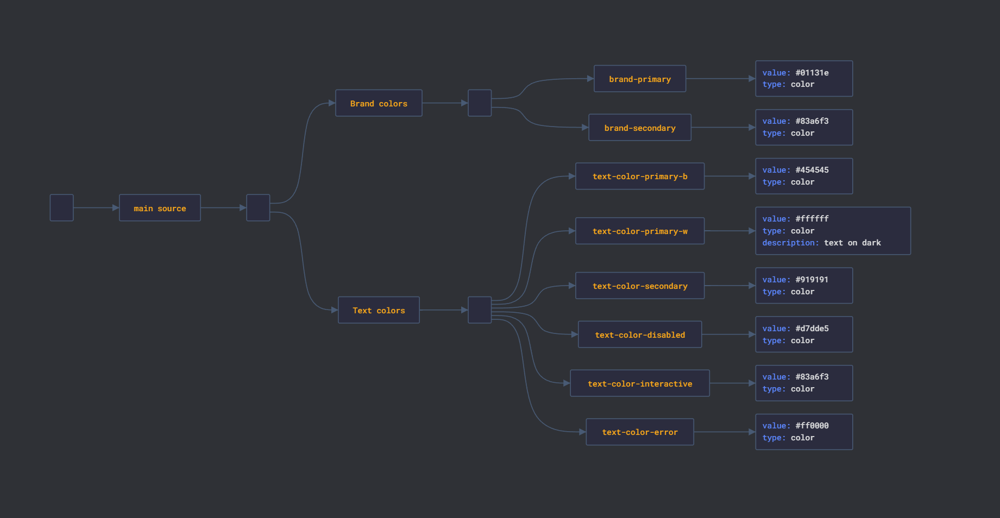
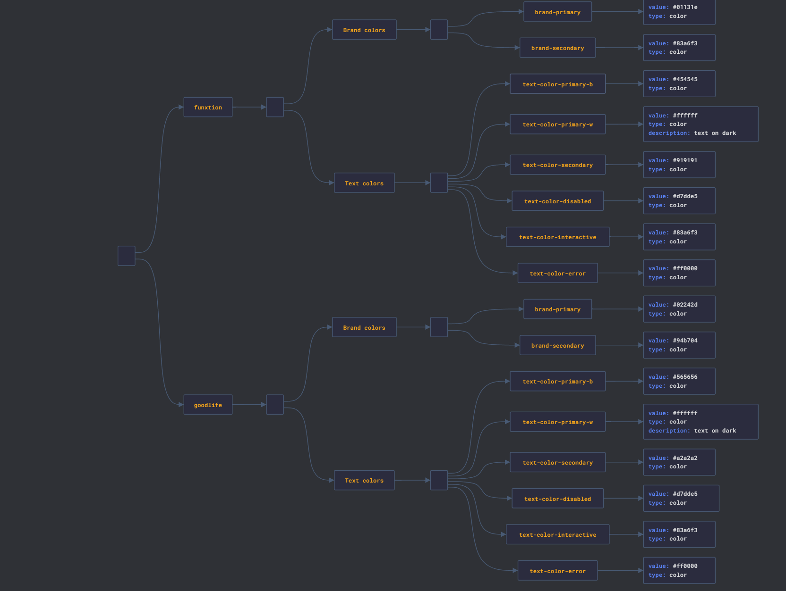
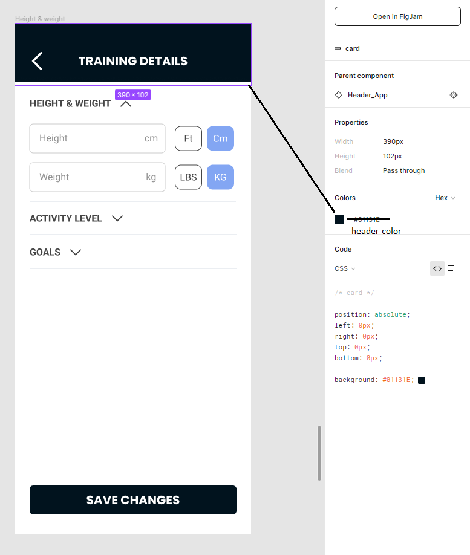

# Color Variables Proposal

In the JSON data of the design tokens, I noticed something about the relationship between the color variables. In the below diagram of minified version of our design tokens, we see this relationship. There is a category called "main source", which has all the color variables in it. In this "main source", there are other categories as well: "brand categories" and "text colors" for the moment. We have other categories but I omitted them so we can focus easily. At the moment, as far as I can see, this relationship of categories doesn't give a clear idea how do we deal with multiple labels.



My idea of this relationship is a bit different. Instead of we have this "main source", we have it as the brand's name. This will allow us to incorporate multiple labels' color variables. Therefore, my initial thought of this relationship is this:



In this diagram, each label we have has the same variable names, but they have different colors. This way we can incorporate different labels' colors with the same variable names. In the above diagram, both "funxtion" and "goodlife" brands have brand colors and text colors. But their values are different.

## Workflow in the Frontend

In the frontend, we have something called "build system". This build system generates different code depending on the label. As a preference, we will set these color variables for each label in the "build configuration". For example, a color configuration for Goodlife in the frontend would look something like this:

```scss
$brand-primary: #02242d;
$brand-secondary: #94b704;
$text-color-primary-b: #565656;
$header-color: #482136;
```

For Funxtion, it might look like this:

```scss
$brand-primary: #01131e;
$brand-secondary: #83a6f3;
$text-color-primary-b: #454545;
$header-color: #457261;
```

When we build the app for Goodlife, every reference of `$brand-primary` in our code will be replaced with the Goodlife's `$brand-primary` definition. In the case of Funxtion, same thing happens, but with Funxtion's color configuration. As you can see, the variable names and their amount are the same, but thier values are different in each label configuration.

We don't want a variable `$brand-tertiary` exist in one label configuration but doesnt' exist in others. Every config should define the same variables.

In this proposed way, when the design team made a design of a user feature, they will address the colors with their corresponding variable names. For example, a header's color is not `#454545`, but it is, for example, `$header-color`. That `$header-color` might mean different depending on the label we are building for. We should indicate colors with their names in the design.



## Adding New Colors

In this proposed relationship, if we want to introduce a new variable in the design, we need to define that variable's name in each label in each color category.